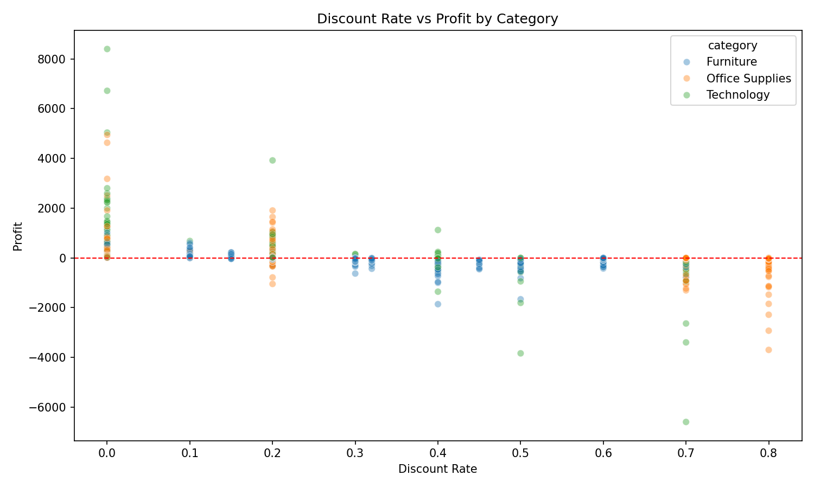

# Superstore Sales Performance Analysis | 2014–2017

## Overview
End-to-end data analysis project using SQL, Python, and Tableau to analyze 
4 years of retail sales data for a fictional office supply company. 
The analysis identifies key drivers of margin erosion and provides 
actionable business recommendations.

**Tools:** DuckDB · DBeaver · Python (pandas, matplotlib, seaborn) · Tableau Public  
**Dataset Size:** 9,994 transactions across 4 years (January 2014 – December 2017)  
**Scope:** 3 product categories · 17 sub-categories · 4 regions · 3 customer segments

---

## Dashboard
🔗 [View Live Tableau Dashboard](https://public.tableau.com/app/profile/tony.tran8567/viz/SuperstoreSalesPerformance_17791501716000/SuperstoreSalesPerformance2014-2017)

---

## Key Findings

**1. Revenue grew 51% over 4 years, but margin is still under pressure**
- Total revenue: $2.3M | Total profit: $286K | Overall margin: 12.47%
- Sales grew from $484K in 2014 to $733K in 2017 with a 51% increase over 4 years
- Profit margin peaked at 13.43% in 2016 then declined to 12.74% in 2017
  despite record-high revenue that year
- Strong Q4 seasonality observed every year (September, November, and 
  December) that consistently drive the highest monthly sales across all 4 years
- This divergence between revenue growth and margin decline signals 
  a structural profitability problem worth investigating

**2. Furniture is destroying margin**
- Furniture is the only category with multiple money-losing sub-categories
- Furniture includes: 
  - Tables: $207K in revenue, net loss of $17,725 (-8.56% margin, worse of all) 
  - Bookcases: $115K in revenue, net loss of $3,473 (-3.02% margin)
  - Supplies: $47K in revenue, net loss of $1,189 (-2.55% margin)
- By contrast, Technology drives the strongest absolute profit at $145K total,
  led by Copiers at 37.2% margin and Accessories at 25.05% margin
- Office Supplies is the most consistent category, with Paper at 43.39% margin,
  followed by Labels (44.42%) and Envelopes (42.27%)

**3. Discount-to-Loss pipeline**
- A clear inverse relationship exists between discount rate and profitability
- Sub-categories with average discounts above 20% are overwhelmingly unprofitable:
  - Tables (26% avg discount, -8.56% margin), Bookcases (21%, -3.02%)
- Sub-categories with average discounts below 8% are the most profitable:
  - Labels (6.87% avg discount, 44.42% margin), Paper (7.49%, 43.39%), Envelopes (8.03%, 42.27%)
- Eliminating deep discounts on Tables alone would recover roughly ~$17K in annual profit
- Notable outlier: Binders carry the highest average discount at 37.23% 
  yet remain profitable at 14.86%, which suggests discount sensitivity 
  varies significantly by product type

**4. Regions: West leads but Central slacks**
- West: $725K sales, 14.94% margin: strongest region on both metrics
- East: $679K sales, 13.48% margin: solid performance across the board
- South: $392K sales, 11.93% margin: smallest region by revenue
- Central: $501K sales, 7.92% margin: least efficient region by far,
  nearly half the margin rate of the West despite higher revenue than the South
- Geographic margin gap points to regional pricing or discount policy differences,
  with the map view confirming concentrated loss areas around Texas and the Midwest

**5. Smaller segments are more efficient**
- Consumer: $1.16M sales (largest), 11.55% margin (lowest), 2,586 orders
- Corporate: $706K sales, 13.03% margin, 1,514 orders
- Home Office: $430K sales (smallest), 14.03% margin (highest), 909 orders
- Inverse relationship between segment size and efficiency suggests 
  Consumer orders may carry higher discounting or less favorable product mix

---

## Business Recommendation
- Superstore should audit its discount policy for Furniture, especially Tables.
- The data shows no margin benefit from discounts above 20%, 
  suggesting a hard cap at 20% discounts across all sub-categories as a baseline,
  with Tables specifically reviewed for whether deep discounting drives 
  meaningful volume gains that justify the losses.
- Reallocating promotional spend toward high-margin Office Supplies 
  (Paper, Labels, Envelopes) would materially improve overall profitability 
  without sacrificing revenue growth.
- The Central region warrants a dedicated pricing review. The margin gap 
  between Central and the West is too large to attribute to geography alone.

---

## Repository Structure
**superstore-sales-analysis/**
- README.md
- sql/
    - analysis_queries.sql        (7 SQL queries covering KPIs, monthly trends,
                                   regional breakdowns, sub-category margin ranking,
                                   and discount vs profit correlation)
- python/
    - superstore_analysis.ipynb   (Discount vs profit scatter plot by category)
- data/
    - superstore_cleaned.csv      (Source dataset, 9,994 rows)
- images/
    - dashboard_screenshot.png    (Tableau dashboard)
    - discount_vs_profit.png      (Python scatter plot)

---

## SQL Analysis Highlights
All queries written in DuckDB via DBeaver. Key queries include:
- Top-line KPI aggregation (total sales, profit, margin %)
- Monthly trend analysis with seasonal pattern identification across 48 months
- Year-over-year growth summary (2014–2017)
- Regional performance comparison (sales, profit, margin % by region)
- Sub-category margin ranking (identified Tables at -8.56% as worst performer)
- Discount vs profit correlation by sub-category (confirmed discount-to-loss pipeline)
- Customer segment breakdown (revenue, margin, and order volume by segment)

---

## Visualizations

### Discount vs Profit (Python)

---
*Dataset: Sample Superstore (public dataset via Kaggle)*  
https://www.kaggle.com/datasets/vivek468/superstore-dataset-final